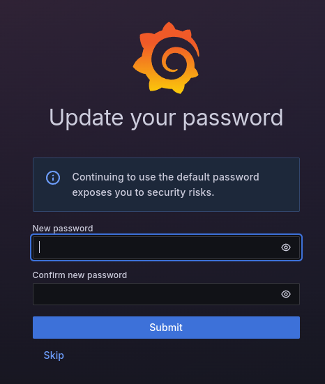

# 1. 도커 컴포즈로 환경 구성하기
```yaml
services:
  prometheus:
    container_name: prometheus
    image: prom/prometheus:latest
    ports:
      - '9090:9090'
    volumes:
      - ./prometheus:/etc/prometheus
    extra_hosts:
      - 'host.docker.internal:host-gateway'
    command:
      - '--config.file=/etc/prometheus/prometheus.yml'
    restart: unless-stopped

  grafana:
    container_name: grafana
    image: grafana/grafana:latest
    ports:
      - '3000:3000'
    depends_on:
      - prometheus
    restart: unless-stopped
```

여기서 `extra_hosts`를 통해서 컨테이너 내부에서 브리지 네트워크를 통해 호스트 시스템에 접근할 수 있도록 했다.

# 2. 프로메테우스 구성
프로메테우스는 아래의 `scrape_interval`에 따라서 모니터링 대상으로부터 15초마다 메트릭 데이터를 수집한다. 스프링 부트 애플리케이션의 경우에는 5초마다 수집하도록 설정했다.

```yaml
global:
  scrape_interval: 15s

scrape_configs:
  - job_name: 'spring-boot-prometheus'
    scrape_interval: 5s
    static_configs:
      - targets: ['localhost:8080']
```

여기서 프로메테우스는 컨테이너 내에서 실행되므로 `localhost`는 사용할 수 없다. 따라서 도커 컴포즈에서 지정한 `host.docker.internal`을 통해 호스트 시스템에 접근하도록 지정해야 한다.

# 3. 그라파나 구성
그라파나가 메트릭을 시각화하기 위해서 사용하는 데이터 소스 중 프로메테우스를 사용하도록 지시한다. 물론 그라파나 컨테이너가 뜬 후에 설정 페이지에서 직접 지정할 수도 있다.
```yaml
apiVersion: 1
datasources:
  - name: Prometheus
    type: prometheus
    access: proxy
    url: http://prometheus:9090
    isDefault: true
```
# 4. 스프링 부트 애플리케이션 구성
이제 프로젝트에 필요한 의존성을 추가하자. 

```groovy
dependencies {
    runtimeOnly 'io.micrometer:micrometer-registry-prometheus:1.13.3'
    implementation 'org.springframework.boot:spring-boot-starter-actuator'
}
```

그 다음에 프로메테우스에서 스프링 부트 애플리케이션에서 메트릭을 수집할 수 있도록 `application.yml`에 아래와 같은 설정을 추가하자.

```yaml
management:
  endpoints:
    web:
      exposure:
        # /actuator/prometheus 엔드포인트를 웹에 노출시킨다.
        include: ["prometheus"]

  endpoint:
    prometheus:
      # prometheus와 통합하기 위한 엔드포인트를 활성화한다.
      enabled: true

    metrics:
      # 메트릭을 제공하는 엔드포인트를 활성화한다.
      enabled: true

  prometheus:
    metrics:
      export:
        # 메트릭을 Prometheus로 내보내는 기능을 활성화한다.
        enabled: true
```

주의할 점은 학습 환경에서는 이상적이지만 프로덕션 환경에서 메트릭이 외부로 노출될 수 있어서 이 부분에 대해서 신중한 고려가 필요하다.

# 4. 그라파나 로그인
`http://localhost:3000`으로 들어가서 기본 사용자명(admin)과 비밀번호(admin)를 입력하자. 로그인을 시도하면 아래와 같이 새 비밀번호를 지정하라는 화면을 볼 수 있다.



로그인이 되면 모니터링을 위한 대시보드를 구성해야 하는데, 직접 만들거나 다른 사용자들이 만든 대시보드를 불러올 수도 있다. 예를 들어서, JVM 메모리나 CPU 사용량, 스레드, 메모리 풀 등의 상태를 확인하려면 [JVM (Micrometer)](https://grafana.com/grafana/dashboards/4701-jvm-micrometer/)를 적용해볼 수도 있다.


